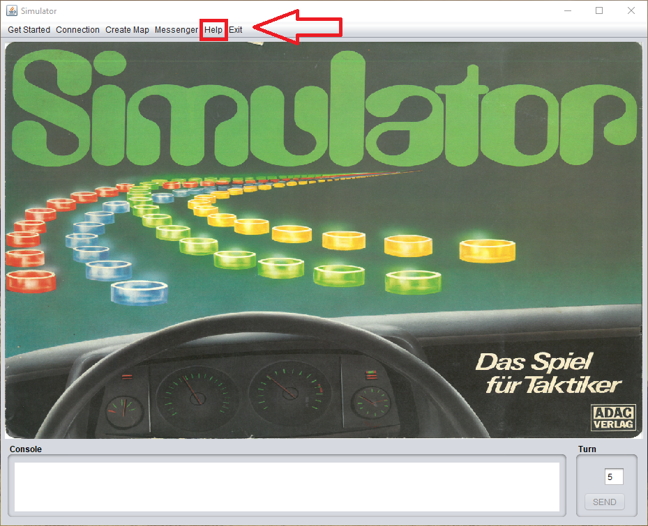

# Java-RMI-Simulator

This was the first java project in my study. It was developed with __NetBeans__ as IDE, __Ant__ as build tool, and
__SVN__ as SCM. Later I decided to import it on my GitHub. To upload it I used transformed it to a __Maven__ project.
The overall code got only a small clean up, so it still contains bugs and a lot of space for improvement.

## Components

* The [Client](Client/src/main/java/simulator/client) provides a simple UI via `Java Swing`.
* The [Server](Server/src/main/java/simulator/server) provides the game logic for the clients and the `RMI-Skeleton` for
  the clients.
* The [Interface](Interface/src/main/java/simulator) provides the `datastructures` and the `RMI-Interfaces` for the
  communication.

## Statistics

While cleaning up the project I introduced __Lombok__ to make the classes more lightweight. This reduced the size of the
classes and saved a lot of LOC.

* Overall Lines: __~5900__
* Java Lines: __~4400__
* Java Lines of Code: __~3400__
* Average Java Class Lines: __~100__

## Notes

* The original project got developed in __NetBeans__. When the UI got created, there was a config file to use the
  Netbeans UI Tool for Swing. When the project was clean up, this file got lost. Therefore, the UI can't be edited
  easily anymore.
* The __Client.jar__ does not work with the resources, because the code references to the development resources.

## Usage

Start the [Server](Server/src/main/java/simulator/server/Server.java) first. After that
the [Client](Client/src/main/java/simulator/client/game/SimulatorMain.java) can create a game and connect with multiple
sessions to the server. Press the __Help Button__ for at least a little of information.

If an actual game is started, the direction of the movement is driven by the __numpad__. Put in the number into the Turn
field.

